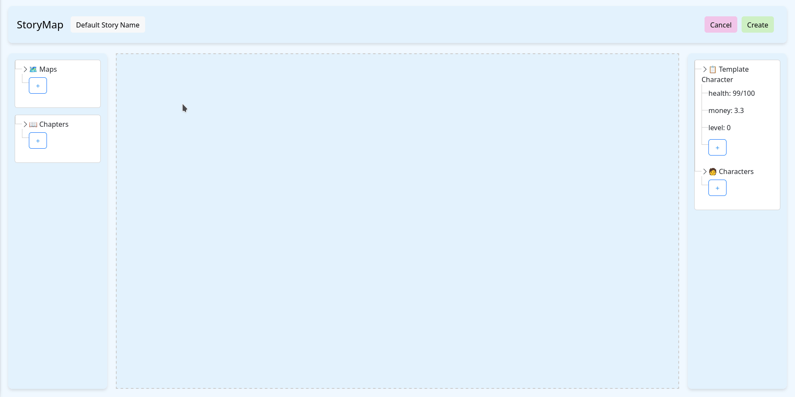
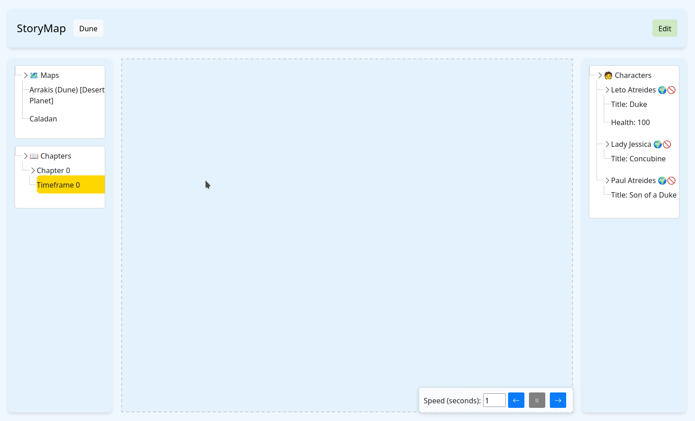

# StoryMap

## Overview

This application enables users to interact with a dynamic map and associated entities such as characters, items, and vehicles. Core Requirements include image uploads, character location tracking, attribute isplay, timeline-based movement visualization, and support for overlays, zooming, and flexible timeframes.

## Obtaining the software
Download the latest release from [release page](https://github.com/CatalinPlesu/StoryMap/releases)
Launch the StoryMap.Presentation.exe (on Linux without exe)
The page is located on [http://localhost:5044/](http://localhost:5044/)
Alternatively run the program with dotnet run

Creating

Seting story name

Adding a map

Creating Characters

Adding atributes

Creating chapters

Playing the story

## Features

## Story 
Story is a Collection of Maps, Characters, and Chapters

##### Requirements:
- [x] Have multiple stories
- [x] Create / View / Edit stories

## Maps
Maps are a collection of images, with support for multiple maps. Each map can
contain multiple images that users can scale and move.

##### Requirements:
- [x] Have multiple maps
- [x] Upload and display images to form a map
- [x] Support overlays and zoom functionality
- [x] Reposition and scale images within a map

## Characters
Characters are displayed on the map with animated movement paths. Each
character has a position on the map and attributes, which are tied to the
timeframe of a chapter.

##### Requirements:
- [x] Track and display character locations on maps using markers or pointers.
- [x] Animate character movement between points on the map.
- [x] attributes (e.g., health, money).
- [x] Position and attributes are tied to specific timeframes 

## Chapters
Chapters organize timeframes in chronological order, connecting characters,
their positions, and attributes to specific events.

##### Requirements:
- [x] Group timeframes into chapters

## Export Feature
The platform provides planned export capabilities to share and integrate story
data.

##### Requirements:
- [ ] Export stories as a zip file
- [ ] Import zip files 
- [ ] Embed maps and related data within EPUB files

## Design Patterns
This project was developed for a university course that mandated the use of design 
patterns.

### Creational
- [x] **Singleton** State
- [x] **Builder** Build Story Data to save it
- [x] **Prototype** Clone character, template character

### Structural
- [x] **Decorator** To modify the init function for Home and Story page
- [x] **Facade** Story Facade - simplified access  
- [x] **Proxy** Before accessing backend use given strategy
### Behavioural
- [x] **Observer** Notify canvas when to redraw  
- [x] **State** view/edit/create modes  
- [x] **Strategy** Backend API - Database / Local Storage  
